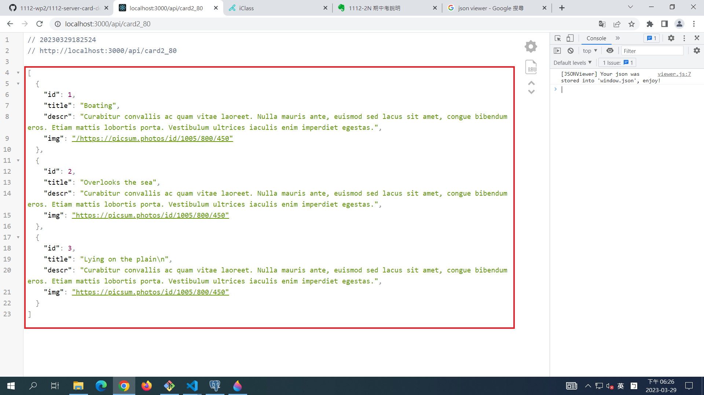

### S1. 前端 theme (html, css)

[My Theme URL](https://codepen.io/utilitybend/pen/bGvjLba)

### S2. 提供相關的 SQL 指令，顯示如何將 theme 內 data 放入資料庫中

### 1.database connection to project_80

### 2.create table card_80 with 3 data

### S3. 測試可以取得資料庫中的資料"

### S4. 提供 api 路由，可以透過 api 路由取得 json data

http://localhost:3000/api/card2_80

