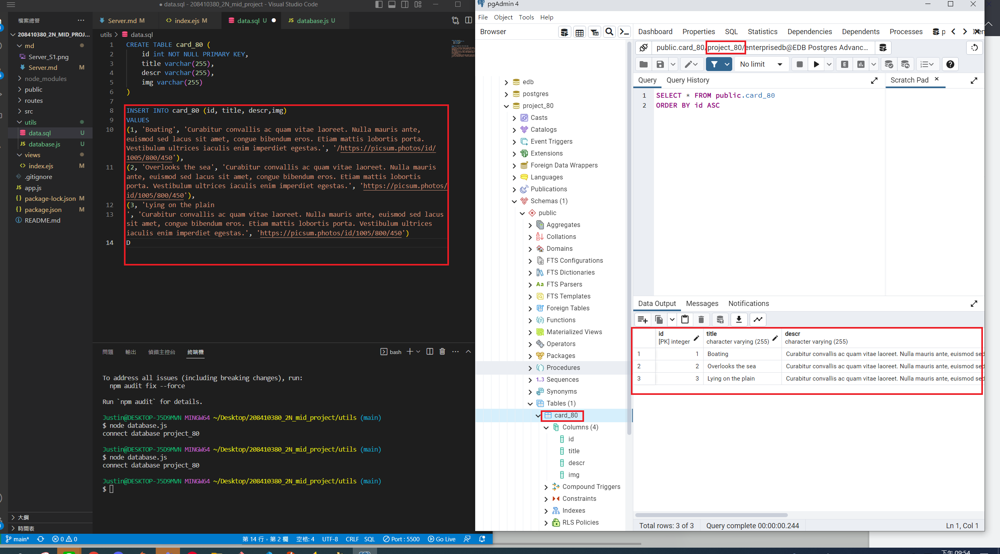
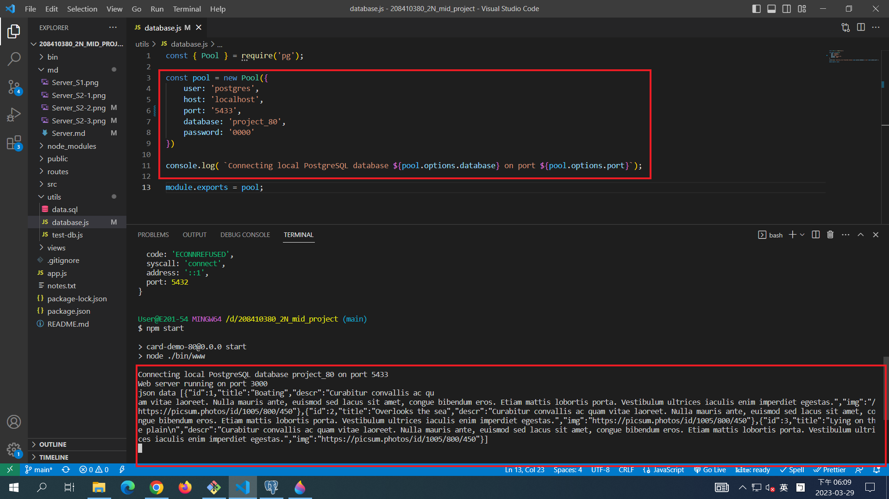
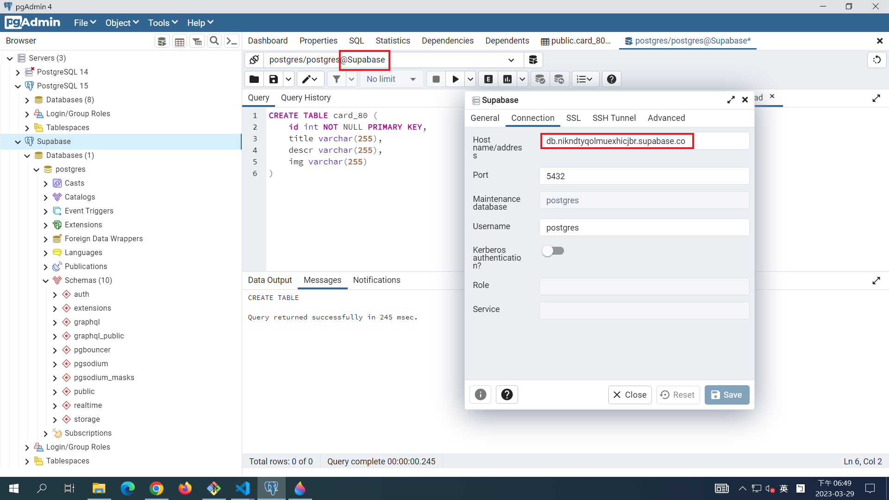
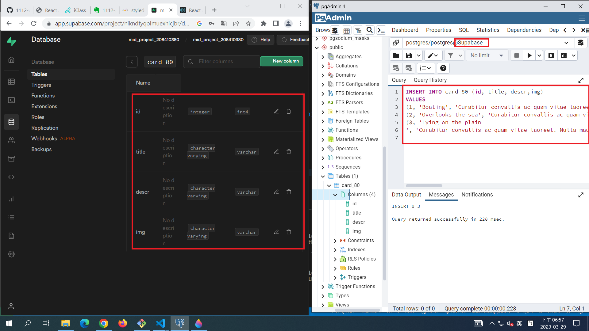
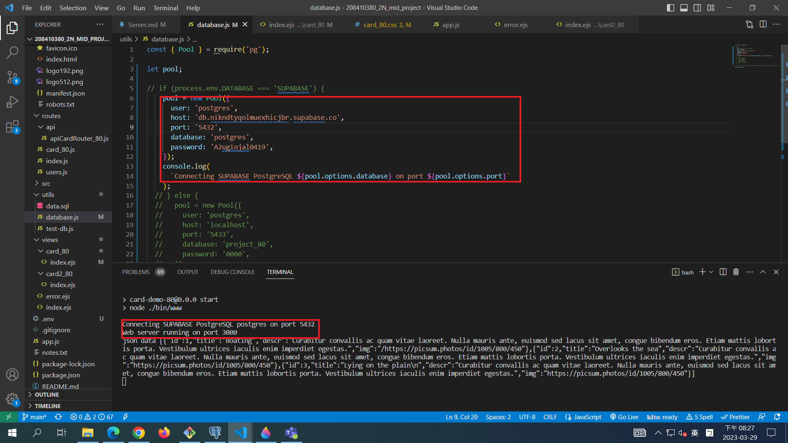

[My GitHub Backend Repo URL](https://github.com/justin40715/208410380_2N_mid_project_backend)

### S1. 前端 theme (html, css)

[My Theme URL](https://codepen.io/utilitybend/pen/bGvjLba)


```
700549d justin40715     Tue Mar 28 20:32:51 2023 +0800  S1. 前端 theme (html, css)
```

### S2. 提供相關的 SQL 指令，顯示如何將 theme 內 data 放入資料庫中

### 1.database connection to project_80


### 2.create table card_80 with 3 data




```
80cb9bd justin40715     Tue Mar 28 23:42:07 2023 +0800  S2. 提供相關的SQL指令，顯示如何將theme內data放入資料庫中
```

### S3. 測試可以取得資料庫中的資料

### 1. 成功取得 local 端資料(postgres)



```
1a95470 justin40715     Wed Mar 29 18:15:55 2023 +0800   S3. 測試可以取得資料庫中的資料
```

### S4. 提供 api 路由，可以透過 api 路由取得 json data

http://localhost:3000/api/card2_80

### 1.Node 端 Json data


### 2.使用 postgres 連結 supabase 加入 data



### 3.supabase 端 table 顯示



### 4.測試連接 supabase 成功



```
b9dcae1 justin40715     Wed Mar 29 18:27:27 2023 +0800  S4. 提供 api 路由，可以透過 api 路由取得 json data
```
