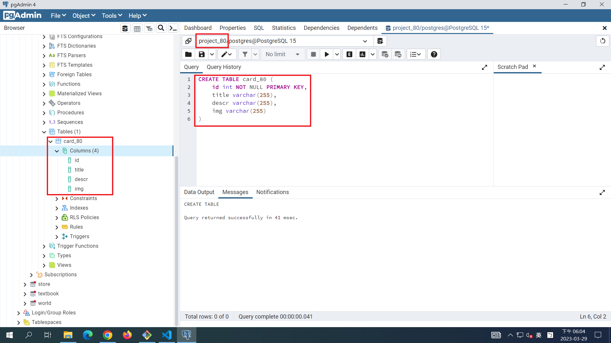

### S1. 前端 theme (html, css)

[My Theme URL](https://codepen.io/utilitybend/pen/bGvjLba)

### S2. 提供相關的SQL指令，顯示如何將theme內data放入資料庫中

### 1.database connection to project_80

### 2.create table card_80 with 3 data

![](Server_S2-3.png